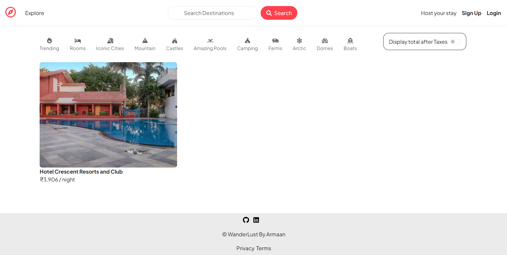
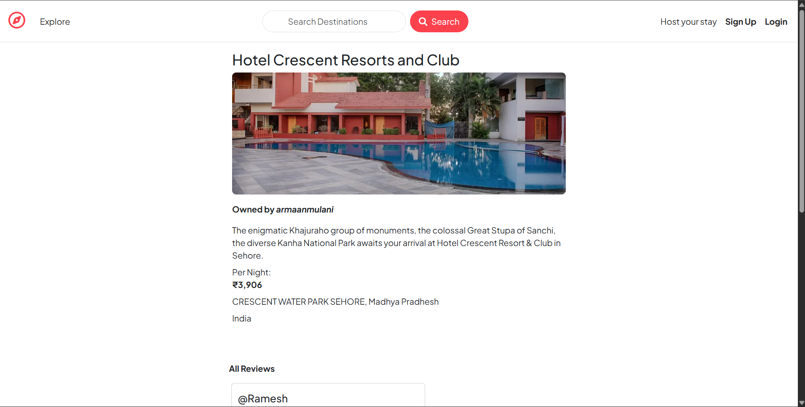
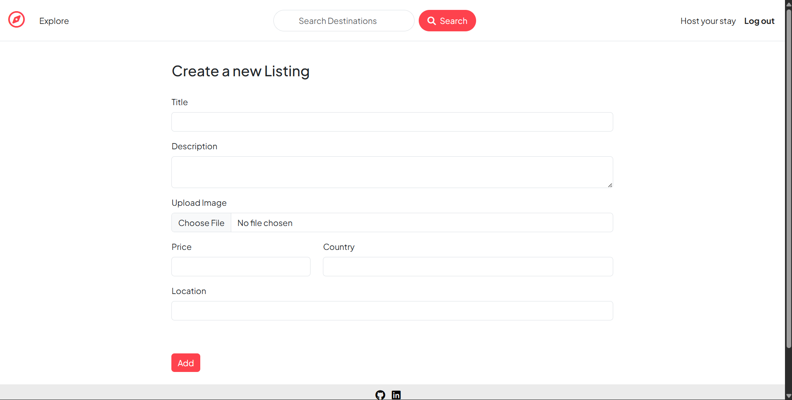
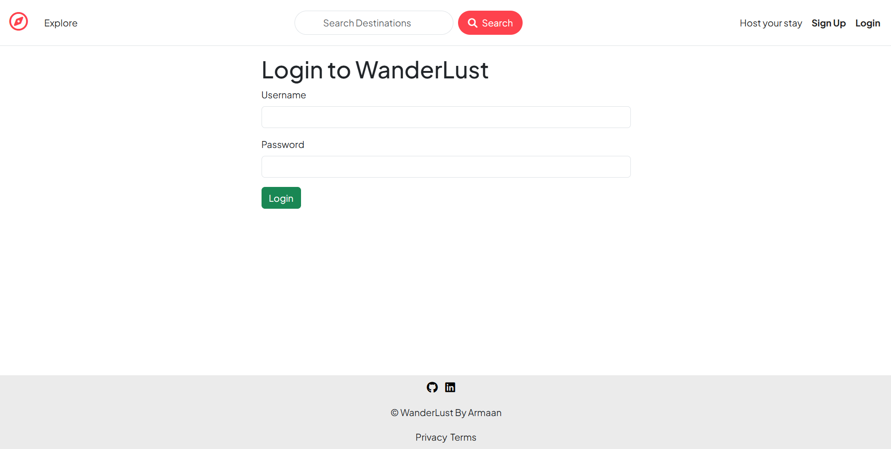

# 🌍 WanderLust

**WanderLust** is a full-stack travel stay listing web application inspired by platforms like **Airbnb**.  
It allows users to explore travel destinations, create and manage property listings, upload images, and share reviews.

🔗 **Live Demo:** [WanderLust Live](https://wanderlust-armaan.vercel.app/listings)  
📂 **GitHub Repository:** [WanderLust](https://github.com/armaan941/wanderlust)

---

## 📌 Overview

WanderLust is designed to simulate a real-world travel accommodation platform where users can:

- Browse and explore stay listings
- Create and manage their own listings
- Upload listing images
- Leave reviews and ratings
- Experience secure authentication and protected actions

This project demonstrates key full-stack development concepts such as **CRUD operations, MVC architecture, authentication, authorization, cloud storage integration, and deployment**.

---

## ✨ Features

- 🔐 **User Authentication**
  - Signup, Login, Logout
- 🏠 **Listing Management**
  - Create, Edit, Delete Listings
- 🖼️ **Image Upload**
  - Upload and manage listing images using Cloudinary
- ⭐ **Review System**
  - Add and delete reviews for listings
- 📍 **Location-Based Listings**
  - Display destination and location information
- 💬 **Flash Messages**
  - User-friendly success and error notifications
- 🛡️ **Authorization**
  - Only owners can edit/delete their listings
  - Only review authors can delete their reviews
- 📱 **Responsive UI**
  - Optimized for desktop and mobile devices

---

## 🛠️ Tech Stack

### **Frontend**
- HTML
- CSS
- Bootstrap
- EJS

### **Backend**
- Node.js
- Express.js

### **Database**
- MongoDB Atlas
- Mongoose

### **Authentication & Security**
- Passport.js
- Passport Local
- Express Session

### **File Upload & Media**
- Cloudinary
- Multer
- Multer Storage Cloudinary

### **Validation & Utilities**
- Joi
- Method Override
- Connect Flash
- Dotenv

---

## 🧱 Project Architecture

This project follows the **MVC (Model-View-Controller)** architecture:

- **Models** → Handle database structure and logic
- **Views** → Render dynamic frontend pages using EJS
- **Controllers** → Manage request handling and business logic
- **Routes** → Define API and page endpoints

This structure improves **code organization, scalability, and maintainability**.

---

## 📂 Folder Structure

```bash
WanderLust/
│── controllers/         # Route logic and request handling
│── models/              # Mongoose schemas and database models
│── routes/              # Express route definitions
│── views/               # EJS templates
│── public/              # Static assets (CSS, JS, images)
│── utils/               # Utility functions and error handlers
│── init/                # Database initialization / seed files
│── app.js               # Main application entry point
│── cloudConfig.js       # Cloudinary configuration
│── middleware.js        # Custom middleware functions
│── schema.js            # Joi validation schemas
│── package.json
│── README.md

## 📸 Screenshots

## Homepage


## Listing Page


## Create Listing


## Login Page

```

---

## ⚙️ Installation & Setup

### 1️⃣ Clone the repository

```bash
git clone https://github.com/armaan941/wanderlust.git
cd wanderlust
```

### 2️⃣ Install dependencies

```bash
npm install
```

### 3️⃣ Create a `.env` file

In the root folder, create a `.env` file and add:

```env
ATLASDB_URL=your_mongodb_connection_string
SECRET=your_session_secret

CLOUD_NAME=your_cloudinary_cloud_name
CLOUD_API_KEY=your_cloudinary_api_key
CLOUD_API_SECRET=your_cloudinary_api_secret

MAP_TOKEN=your_mapbox_token
```

---

### 4️⃣ Run the app locally

```bash
nodemon app.js
```

or

```bash
node app.js
```

---

### 5️⃣ Open in browser

```bash
http://localhost:8080/listings
```

---

## 🔐 Authentication & Authorization

This project includes secure authentication and authorization features:

* User Signup / Login / Logout
* Only logged-in users can create listings
* Only owners can edit/delete their listings
* Only review authors can delete their reviews

---

## 🌐 Deployment

This project can be deployed using:

* **Render** → backend hosting
* **MongoDB Atlas** → database
* **Cloudinary** → image storage

After deployment, update this line near the top:

```md
🔗 **Live Demo:** [WanderLust Live](https://your-live-link.onrender.com)
```

---

## 🧠 Learning Outcomes

This project helped in understanding and practicing:

* RESTful Routing
* MVC Architecture
* CRUD Operations
* Authentication & Sessions
* File Uploads
* Database Relationships
* Deployment of Full-Stack Applications

---

## 🚧 Future Improvements

* 🔍 Search & filter listings
* ❤️ Wishlist / favorites feature
* 🗺️ Interactive map for listings
* 📱 Improved mobile responsiveness
* 💬 User-to-user messaging
* 📊 Better admin / dashboard features

---

## 👨‍💻 Author

**Armaan Mulani**

* GitHub: [@armaan941](https://github.com/armaan941)

---

## 📄 License

This project is built for educational and learning purposes.
